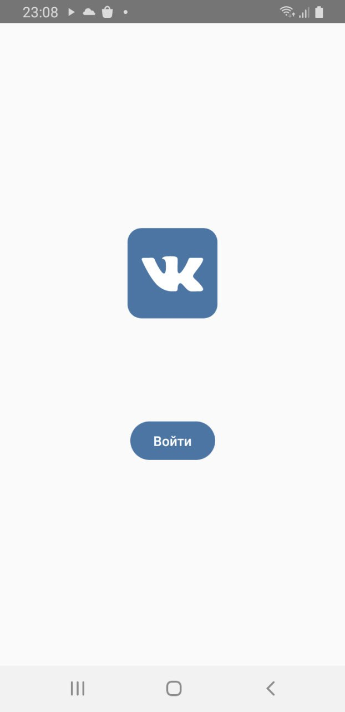
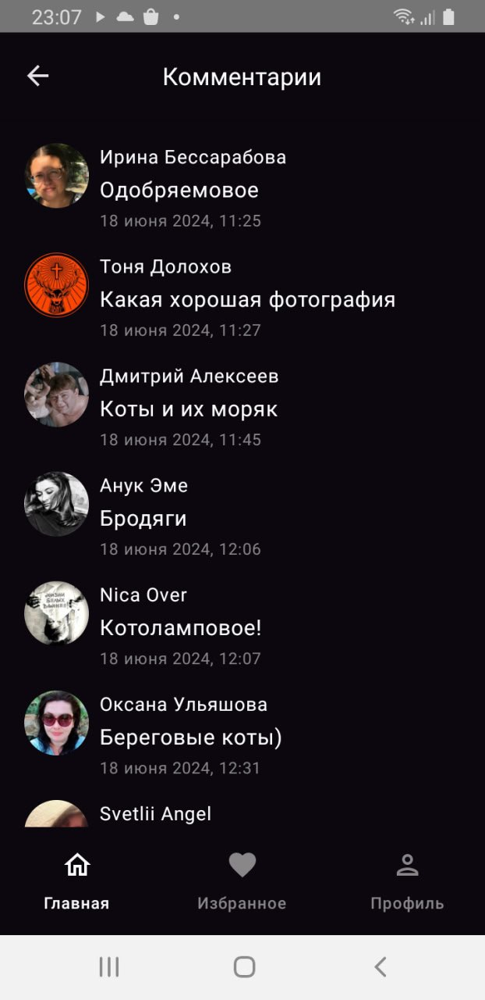

# VkNewsClient (ВК-клиент)
Учебное приложение (изучение Jetpack Compose)

Android-приложение, которое представляет из себя ВК-клиент, в котором пользователь может авторизоваться через ВК и получить доступ к ленте новостей, возможность поставить и убрать лайк, посмотреть комментарии под публикации (постами) и также убрать в "Не интересно" пост через свайп. В нём три экрана: авторизация, лента и комментарии под постом.

Стек
-
Jetpack Compose, Jetpack Compose Navigation, MVVM, Flow, VK SDK, Coil (Compose), Gson, Dagger2, Retrofit2, Okhttp-logging-interceptor, Clean Architecture

Внешность
-

| Авторизация | Лента | Комментарии под постом |
|:-:|:-:|:-:|
||||
